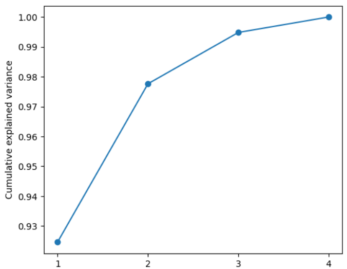
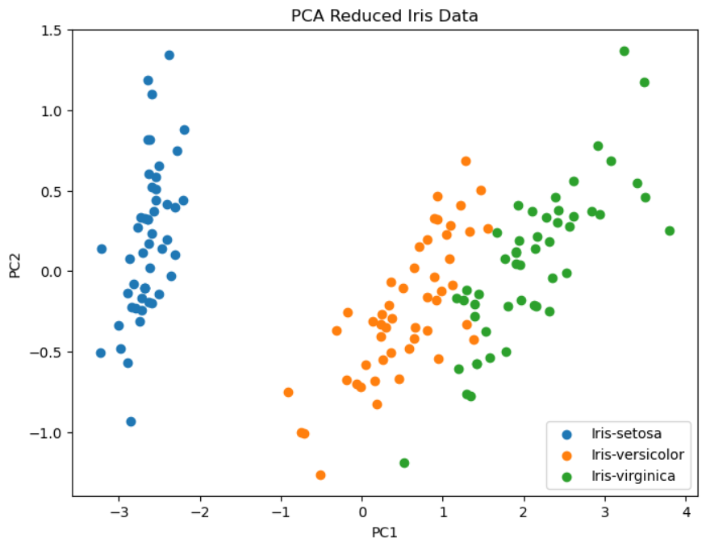

 # Applying PCA to flowers 🌷
 
The *\"Iris dataset\"* is a collection of measurements popularised by statistician [Ronald Fisher](https://en.wikipedia.org/wiki/Ronald_Fisher) in 1936. It contains measurements on the length and width of the petals and sepals of 150 flowers of 3 different species in the *Iris* genus (50 each).

We are going to apply PCA to this dataset to **reduce** the dimensionality of the matrix from 4 to 2.

## How PCA works, briefly explain 

PCA finds the *principal component*, which are the **underlying structure** in the data. They are the directions where there is the most variance, the directions where the data is most spread out.

PCA finds those variables ranked according to the variance of data along them, it means that more important principal components occurs first. **(more important = more variance/more spread out data)**

### Steps

- Get data and **center** it 

- Calculate the **covariance matrix** X of data points.
  
- Calculate **eigenvectors**, **eigenvalues** and **sort** them in descending order.
    
- **Choose first** k eigenvectors and **project** the new components.

- Calculate the **reconstruction error**
  
### Graphical view of the variance of each principal component

###### *Note: In the following graph, we can observe that the first principal component accounts for approximately 92% of the total variance. Including the second principal component increases the explained variance to about 97%, which is sufficient for most cases. In conclusion we can exclude the remaining components*

### Plot of the data once reduced

##### *The final graph represents a 2-dimensional visualization of the Iris dataset after applying Principal Component Analysis (PCA) to reduce its original 4 dimensions (sepal length, sepal width, petal length, and petal width) to just 2 dimensions. This reduction captures the majority of the variance in the data while simplifying its structure for easier interpretation.*

#### Conclusion

Applying **Principal Component Analysis (PCA)** to the *Iris dataset* demonstrates a clear **trade-off** between the number of principal components and the reconstruction error, measured by the **mean squared error (MSE)**. As the number of principal components increases, the retained variance approaches 100%, and the **loss of variance** decreases significantly. 

- With only **one** principal component, a substantial **loss** of **34.22%** occurs, highlighting limited data representation.  
- Adding a **second** component reduces the **loss** to **10.15%**, showing a significant improvement in reconstruction accuracy.  
- By including a **third** components, the loss **drops** further to **2.35%**, capturing nearly all the variance.  
- Finally, using **all** principal components **eliminates any loss** of variance, achieving perfect reconstruction of the original data.

This analysis underscores the importance of selecting an appropriate number of components based on the balance between minimizing information loss and achieving **dimensionality reduction**. For the Iris dataset, 2 principal components provide a sufficient description of the data, retaining most of the variance while significantly reducing dimensionality.
